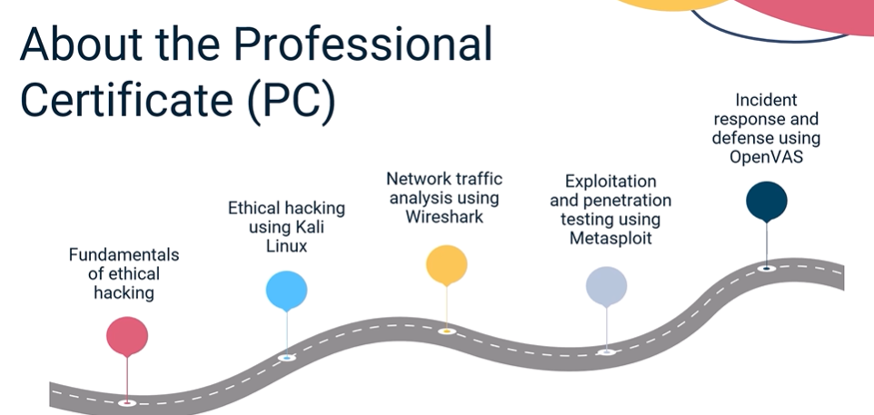
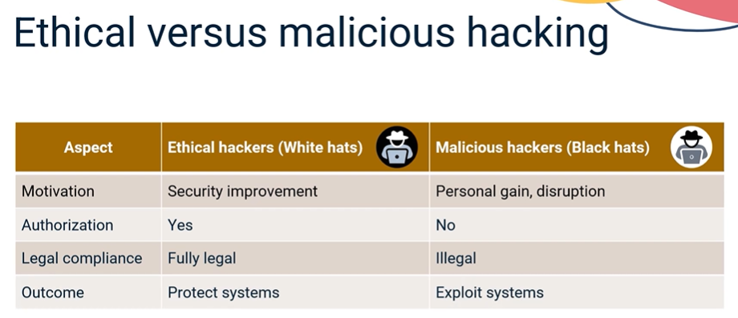
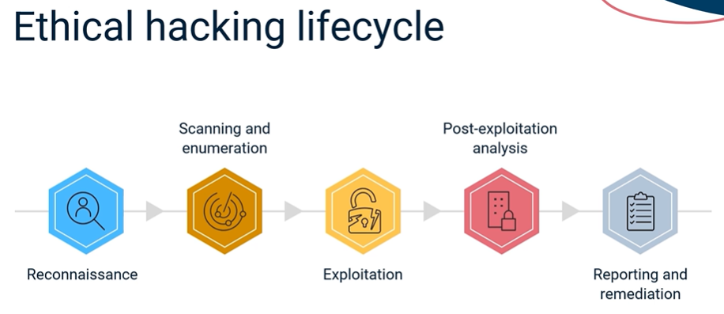
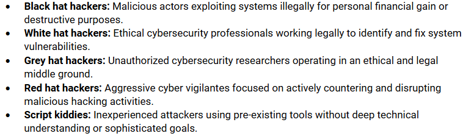

- Course 1 in Specialization: Introduction to Ethical Hacking Principles

- Course Overview | [Link](https://www.coursera.org/learn/introduction-to-ethical-hacking-principles/supplement/IOLDc/course-overview)
    - Understanding Ethical Hacking
    - Types of Hackers and Cyber Attacks
    - Legal and Ethical Considerations

- Module 1

    - 
    - 
    - 
    - 

- Summary of Module 1:

    - Ethical hacking, also known as penetration testing or pen testing, means deliberately testing systems, networks, and applications to find vulnerabilities before attackers do, with full permission from the organization and following legal boundaries.

    - Ethical hackers and malicious hackers differ significantly in their motivations, authorization, legality, and outcomes - ethical hackers protect systems while malicious hackers exploit them.

    - The ethical hacking lifecycle follows five key phases: reconnaissance (gathering information about the target), scanning and enumeration (identifying vulnerabilities), exploitation (safely testing discovered vulnerabilities), post-exploitation analysis (assessing potential attacker access), and reporting and remediation (documenting findings with recommendations).

    - Common hacker motivations include financial gain (ransomware, stealing credit card data), hacktivism (politically or socially motivated attacks), espionage (stealing confidential data), curiosity and challenge (testing skills), and revenge and sabotage (disgruntled individuals targeting former employers).

    - Hackers can be classified based on intent and ethics into various categories, including black hat (malicious), white hat (ethical), gray hat (unauthorized but well-intentioned), blue hat (external testers), red hat (anti-black hat vigilantes), green hat (novice learners), script kiddies (unskilled amateurs), hacktivists (ideologically driven), state-sponsored hackers, insider threats, and cyber terrorists.

    - The code of conduct for ethical hackers includes key principles: obtaining explicit authorization with a defined scope before testing, maintaining the confidentiality of sensitive data, avoiding damage or disruption to systems, complying with all applicable laws and regulations, and delivering professional and accurate reports.

    - Real-world ethical hacking case studies demonstrate how security researchers protect organizations through bug bounty programs that incentivize the responsible disclosure of vulnerabilities, such as the Google Chrome zero-day vulnerability fix, the Apple iCloud account takeover prevention, and the “Hack the Pentagon” program.

    - The Equifax data breach and similar incidents highlight the consequences of ignoring known vulnerabilities and how proactive ethical hacking assessments could have identified these flaws before malicious exploitation.

    - Ethical hackers play a critical role in cybersecurity by thinking like attackers but acting responsibly and legally, helping organizations identify weaknesses early, understand attacker methodologies, and improve their overall security posture.

    - Bug bounty programs have become standard practice among tech companies, government agencies, and critical infrastructure providers, enabling scalable, crowdsourced security testing that prevents potential data breaches before exploitation occurs.Ethical hacking, also known as penetration testing or pen testing, means deliberately testing systems, networks, and applications to find vulnerabilities before attackers do, with full permission from the organization and following legal boundaries.

    - Ethical hackers and malicious hackers differ significantly in their motivations, authorization, legality, and outcomes - ethical hackers protect systems while malicious hackers exploit them.

    - The ethical hacking lifecycle follows five key phases: reconnaissance (gathering information about the target), scanning and enumeration (identifying vulnerabilities), exploitation (safely testing discovered vulnerabilities), post-exploitation analysis (assessing potential attacker access), and reporting and remediation (documenting findings with recommendations).

    - Common hacker motivations include financial gain (ransomware, stealing credit card data), hacktivism (politically or socially motivated attacks), espionage (stealing confidential data), curiosity and challenge (testing skills), and revenge and sabotage (disgruntled individuals targeting former employers).

    - Hackers can be classified based on intent and ethics into various categories, including black hat (malicious), white hat (ethical), gray hat (unauthorized but well-intentioned), blue hat (external testers), red hat (anti-black hat vigilantes), green hat (novice learners), script kiddies (unskilled amateurs), hacktivists (ideologically driven), state-sponsored hackers, insider threats, and cyber terrorists.

    - The code of conduct for ethical hackers includes key principles: obtaining explicit authorization with a defined scope before testing, maintaining the confidentiality of sensitive data, avoiding damage or disruption to systems, complying with all applicable laws and regulations, and delivering professional and accurate reports.

    - Real-world ethical hacking case studies demonstrate how security researchers protect organizations through bug bounty programs that incentivize the responsible disclosure of vulnerabilities, such as the Google Chrome zero-day vulnerability fix, the Apple iCloud account takeover prevention, and the “Hack the Pentagon” program.

    - The Equifax data breach and similar incidents highlight the consequences of ignoring known vulnerabilities and how proactive ethical hacking assessments could have identified these flaws before malicious exploitation.

    - Ethical hackers play a critical role in cybersecurity by thinking like attackers but acting responsibly and legally, helping organizations identify weaknesses early, understand attacker methodologies, and improve their overall security posture.

    - Bug bounty programs have become standard practice among tech companies, government agencies, and critical infrastructure providers, enabling scalable, crowdsourced security testing that prevents potential data breaches before exploitation occurs.

- Summary of Module 2:

    - Ethical hacking often involves systems, users, and data distributed across multiple countries.

    - Cybersecurity professionals must adhere to regulatory frameworks depending on the region, sector, and work type.

    - The five major regulations and frameworks from around the world are:

        - General Data Protection Regulation or GDPR from the European Union

        - Computer Fraud and Abuse Act or CFAA from the United States

        - California Consumer Privacy Act or CCPA from the state of California

        - Directive on security of Network and Information Systems or NIS Directive from the European Union

        - Digital Personal Data Protection Act or DPDP from India

    - Ethical hacking contracts clarify roles, responsibilities, scope, and communication protocols; violating any of which can result in legal penalties.

    - Mere good intentions are not enough when it comes to ethical hacking. To protect themselves from legal risks, ethical hackers must obtain written authorization, follow legal requirements across jurisdictions, and operate strictly within the limits of the contract.

    - Ethical hackers must follow proper legal protocols to avoid the risk of criminal charges, lawsuits, and career-ending professional sanctions. 

    - When ethical hackers perform penetration tests without prior legal authorization, they may face serious consequences such as civil litigation, criminal charges, certification revocation, and reputational damage.

    - The common legal pitfalls ethical hackers may encounter are exceeding the scope of engagement, inadequate documentation and authorization, and jurisdictional complexity and cross-border legal risks. 

    - Most legal pitfalls stem from miscommunication, inadequate documentation, or a failure to appreciate the global complexity of cyber laws.

    - Without approval, unsolicited testing or responsible disclosure can also result in legal threats, no matter how well-intentioned.

    - While ethical hacking is a powerful tool for identifying and mitigating cybersecurity risks, it must be conducted within a clear legal and ethical framework to ensure compliance and accountability.

- Summary:

    - Ethical hacking does not end with discovering vulnerabilities. 

    - Disclosure is a critical phase in ethical hacking, transforming vulnerability discovery into constructive security improvement. 

    - By following a structured, respectful disclosure process, security researchers can help organizations remediate risks while protecting themselves from legal consequences. 

    - The true impact of vulnerability research lies in how the information is communicated and how the vulnerability is resolved, contributing to a safer digital ecosystem for all users.

    - Security researchers must possess legal, procedural, and technical knowledge to responsibly report security flaws and support remediation. 

    - The disclosure process comprises six steps that involve confirming the vulnerability, reviewing legal boundaries, identifying the right contact, reporting the vulnerability privately, allowing a reasonable time for remediation, and making a responsible public disclosure.

    - The ability to curate effective security reports is an important skill for ethical hackers and security professionals. 

    - A well-structured report bridges the gap between technical discovery and organizational response by ensuring stakeholders understand the nature, severity, and unique identifiers of the issue and know how to remediate it efficiently.

    - The key sections of an effective security report are its executive summary, technical description, reproduction steps, risk assessments, recommendations, and attachments.

    - Some organizations have now adopted bug bounty programs that are structured initiatives to allow ethical hackers to proactively identify and report security vulnerabilities in software, applications, and systems before malicious actors can exploit them. 

    - Bug bounty programs help organizations strengthen their cybersecurity posture by leveraging the global security research community.

    - The standard workflow of a bug bounty program consists of four stages: discovery, submission, validation and triage, and reward and acknowledgment.

    - The security researchers participating in the bug bounty programs benefit from monetary compensation and financial rewards, professional recognition and public acknowledgment, invitations to private programs and career opportunities, and legal protection.

- Course Glossary - [Link](https://www.coursera.org/learn/introduction-to-ethical-hacking-principles/ungradedWidget/tU9X5/course-glossary-introduction-to-ethical-hacking-principles)

- Certificate of Completion - [Link](resources/Introduction%20to%20Ethical%20Hacking%20Principles.pdf)