- Course 2 in Specialization: Ethical Hacking with Kali Linux

- Course Link: [here](https://www.coursera.org/learn/ethical-hacking-with-kali-linux)

- Module 1:

    - 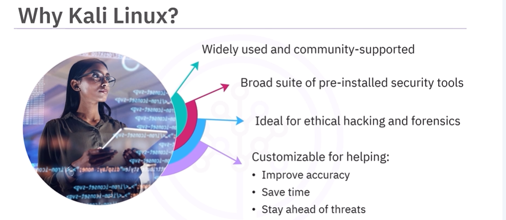
    - 
    - 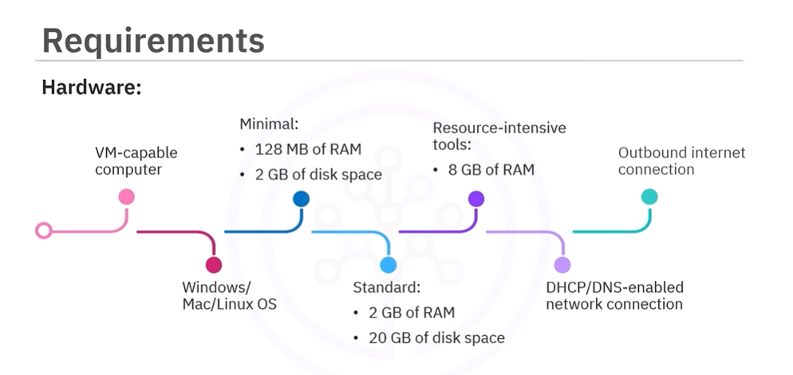

- Before continuing, there is an optional module 5 to get familiar with Linux command line if needed, so doing that first is recommended for those new to Linux.

- Module 5:

    - What is an Operating System?
        - A software:
            - that manages computer hardware and software resources
            - allows interaction with the hardware without needing to know its details
        - Examples:
            - Windows, macOS, Linux distributions (e.g., Kali Linux)
    - Functions of an Operating System:
        - Resource Management:
            - Manages CPU, memory, storage, and peripheral devices
        - File System Management:
            - Organizes and controls data storage and retrieval
        - Process Management:
            - Handles execution of programs and multitasking
        - Security and Access Control:
            - Protects data and system integrity
        - User Interface:
            - Provides a way for users to interact with the system (GUI or CLI)
    - Types of Operating Systems:
        - Single-user vs. Multi-user
        - Single-tasking vs. Multi-tasking
        - Real-time Operating Systems (RTOS)
    - Popular Operating Systems:
        - Windows: Widely used for personal and business computing
        - macOS: Known for its sleek design and integration with Apple hardware
        - Linux: Open-source, highly customizable, popular in servers and development environments
    - What is Unix?
        - Family of Operating Systems:
            - Basis for many modern OS, including Linux and macOS

            - Popular Unix Variants:
                - AIX (IBM)
                - HP-UX (Hewlett-Packard)
                - Solaris (Oracle)
                - FreeBSD (Open-source)
    - What is Linux?
        - Family of Unix-like Operating Systems:
            - Open-source and free to use
            - Developed collaboratively by programmers worldwide
        - Linux Distributions:
            - Variants of Linux OS tailored for specific needs
            - Examples:
                - Ubuntu: User-friendly, popular for desktops and servers
                - Fedora: Cutting-edge features, sponsored by Red Hat
                - Debian: Stable and secure, basis for many other distributions
                - Kali Linux: Specialized for penetration testing and security auditing
        - Linux Features:
            - Free and Open-source
            - Secure and Stable
            - Mutli User
            - Multi Tasking
            - Portable, meaning it can run on various hardware platforms
    - Linux vs Ubuntu
        - Linux:
            - Refers to the kernel, the core part of the OS
            - Basis for various distributions
        - Ubuntu:
            - A specific Linux distribution based on Debian
            - Known for ease of use and user-friendly interface
            - Comes with pre-installed software and regular updates
    - Overview of Linux Architecture:
        - 5 layers: |  
            - UI Layer: allow user interaction, either through GUI or CLI
            - Applications Layer: software that lets you perform tasks, like web browsing, file management, etc. This include system daemons, shells, user apps, tools.
            - Operating System Layer: controls the jobs and programs running on the system, manages resources, and provides essential services.
            - Kernel Layer: performs vital operations, lowest-level software, starts on boot, bridge between hardware and software. Key jobs include process management, memory management, device management, system calls, and security.
            - Hardware Layer: physical components of the computer, like CPU, memory, storage devices, and peripherals.
    - Linux File System:
        - Collection of files and directories organized in a hierarchical structure
        - Root Directory (/): top-level directory containing all other files and directories
        - Tree Structure: directories can contain files and subdirectories, forming a tree-like structure
        - Assigns appropriate access permissions to files and directories for security
        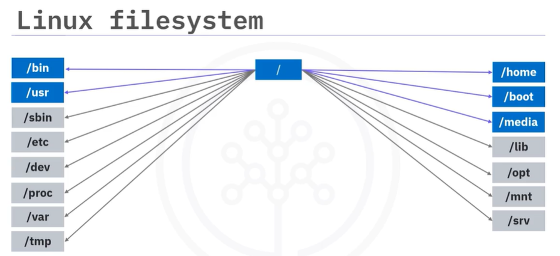
    - Linux Terminal Overview:
        - Command-Line Interface (CLI) application for interacting with the Linux OS
        - Allows users to execute commands, run scripts, and manage files and processes
        - 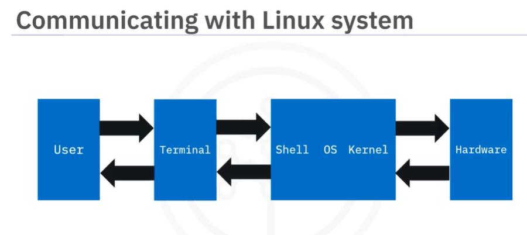
        - Key Components:
            - Shell: program that interprets user commands (e.g., Bash, Zsh)
            - Prompt: indicates the terminal is ready to accept commands
            - Commands: instructions given to the shell to perform specific tasks
        - Basic Terminal Commands:
            - Navigation: `cd`, `ls`, `pwd`
            - File Management: `cp`, `mv`, `rm`, `touch`
            - System Information: `top`, `df`, `free`
            - Process Management: `ps`, `kill`, `bg`, `fg`
        - Customization:
            - Users can customize the terminal appearance and behavior using configuration files (e.g., `.bashrc`, `.zshrc`)
        - Paths in Linux:
            - Absolute Path: complete path from the root directory (e.g., `/home/user/documents`)
            - Relative Path: path relative to the current directory (e.g., `documents/file.txt`)
            - 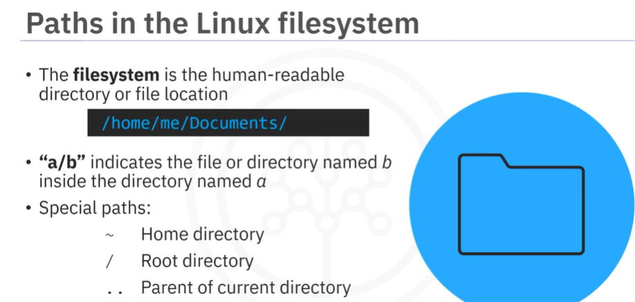

    - Summary [Link](https://www.coursera.org/learn/ethical-hacking-with-kali-linux/supplement/zWsSe/summary-and-highlights-fundamentals-of-linux-operating-system)

    - Overview of Common Linux Commans:
        - 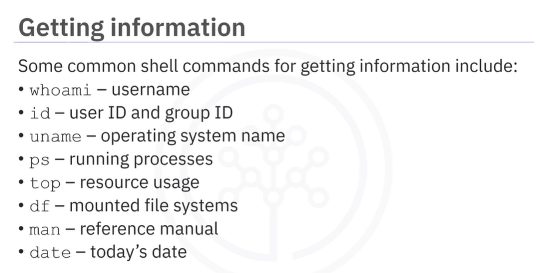
        - 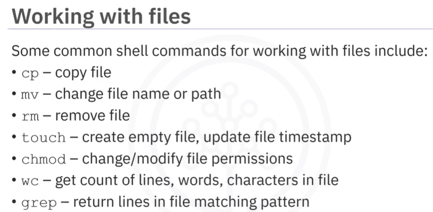
        - 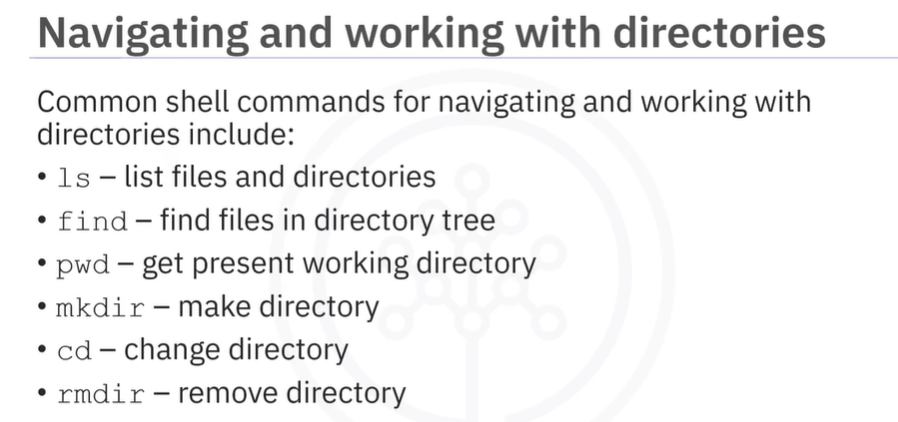
        - 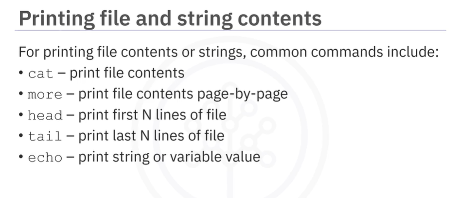
        - 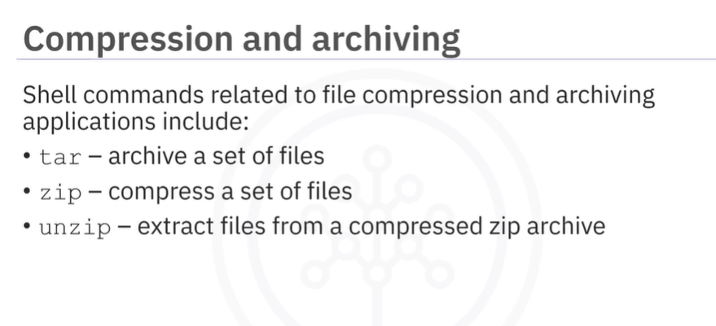
        - 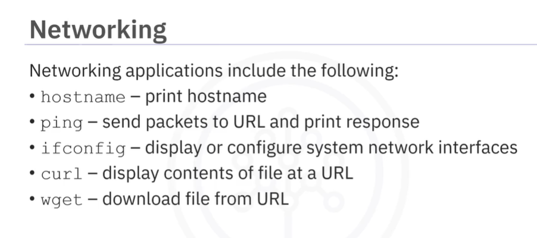
        - 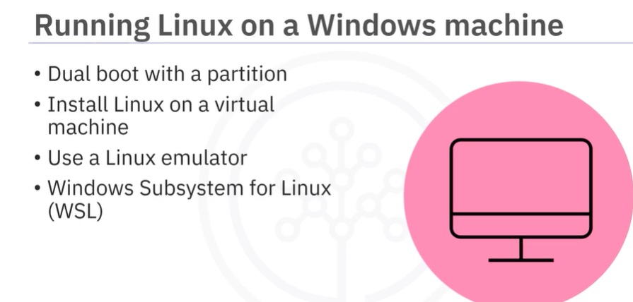