- Course 2 - Machine Learning & Artificial Intelligence with Python | Course [Link](https://www.udemy.com/course/draft/4292808/overview/?udfrontends=true)

- Images / Diagrams

    - 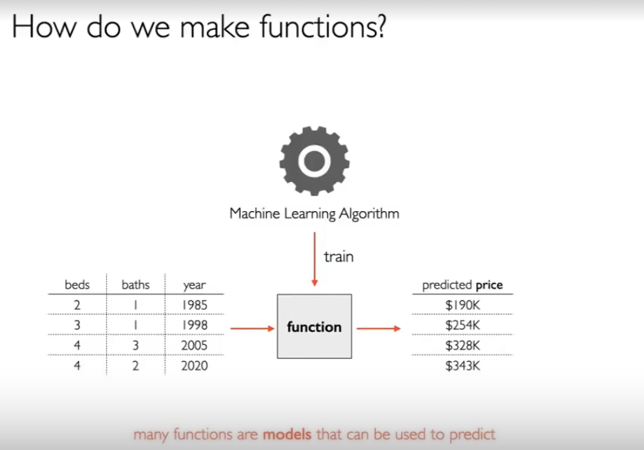
    - 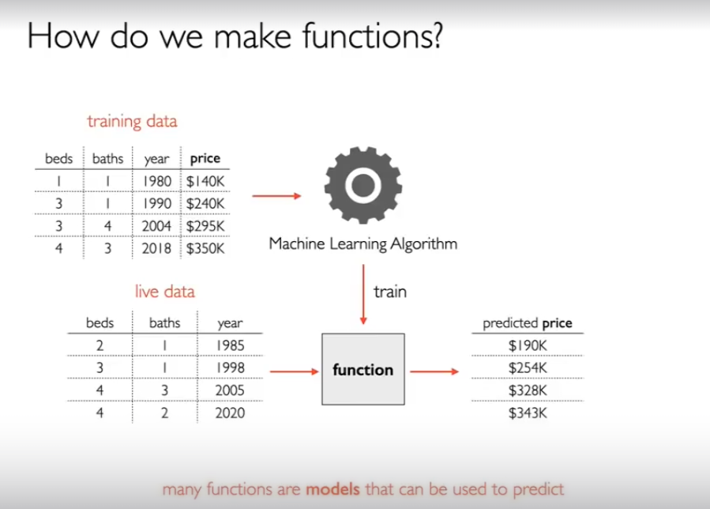
    - 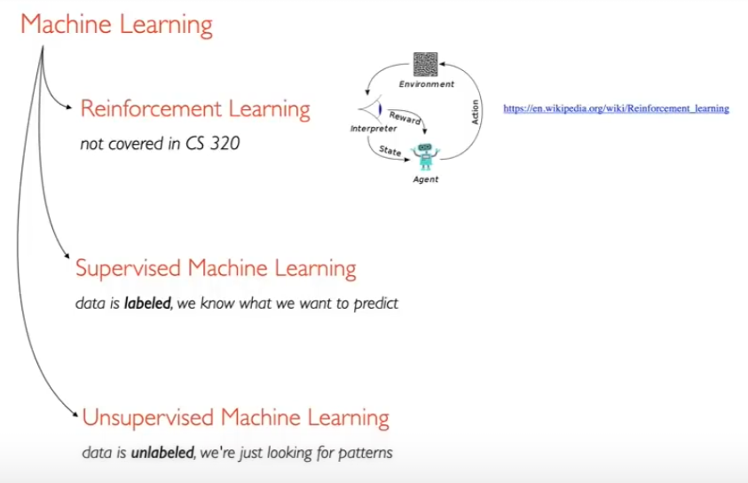
    - 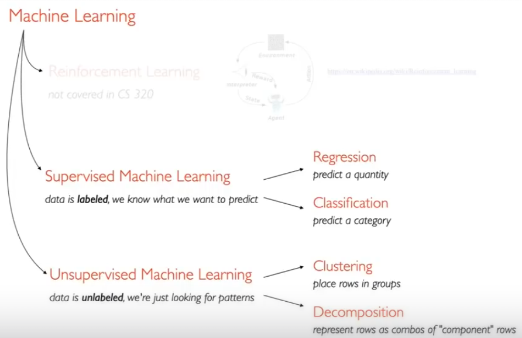
    - 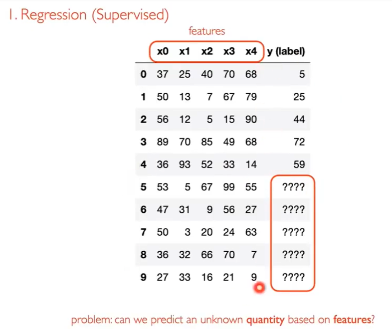
    - 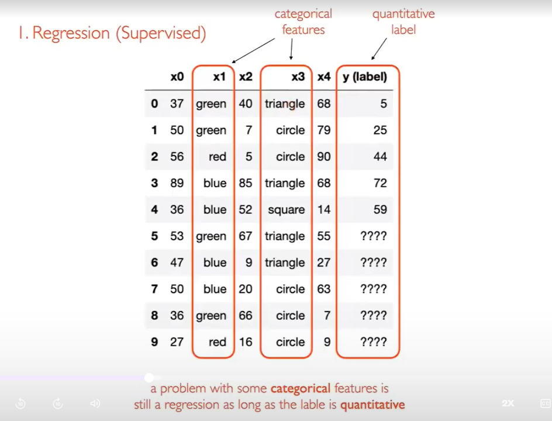
    - 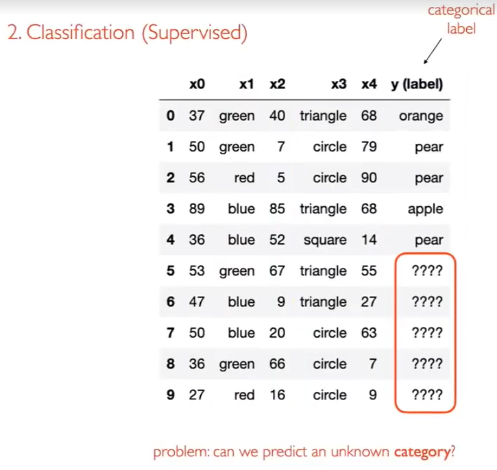
    - 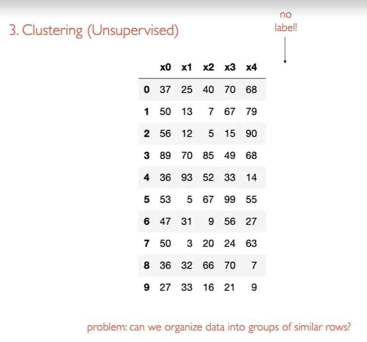
    - 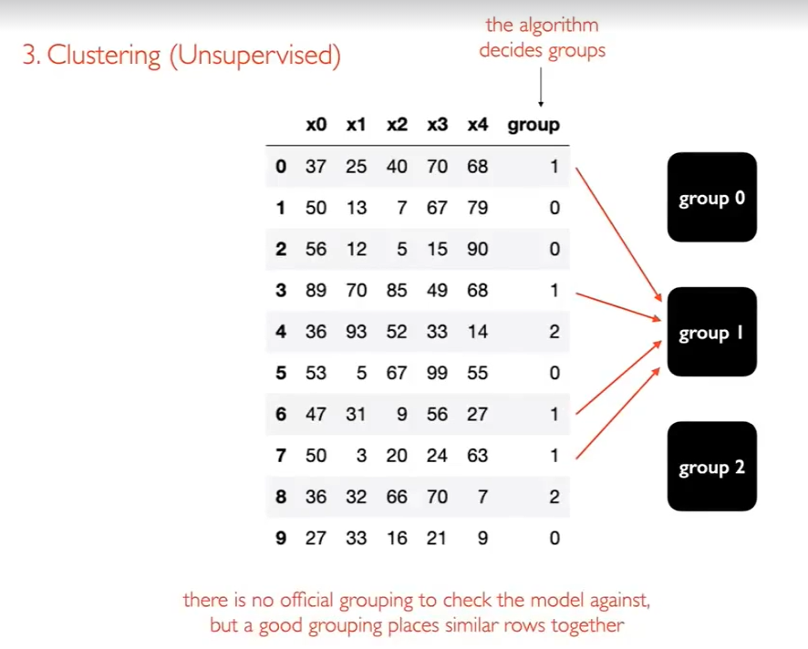
    - 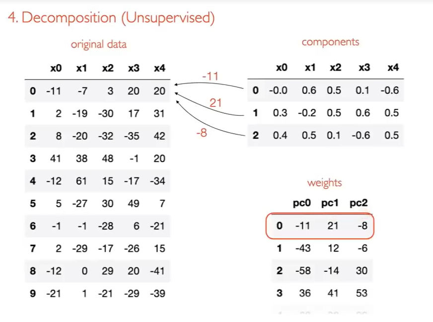
    - 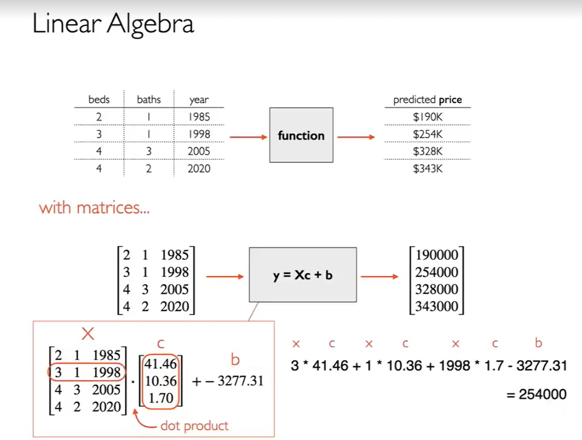
    - 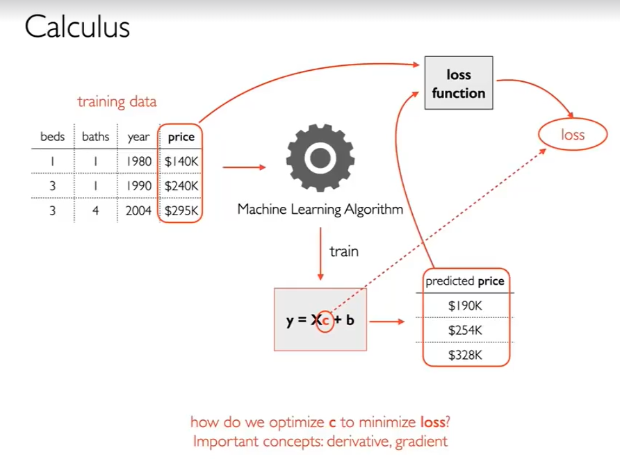
    - 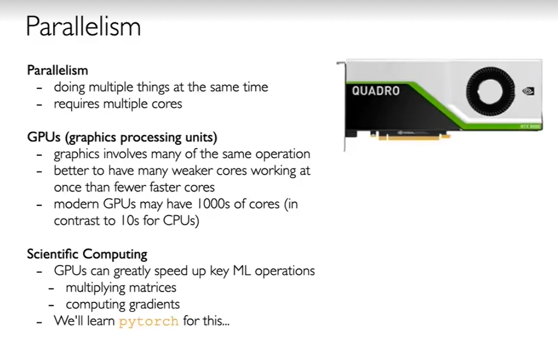